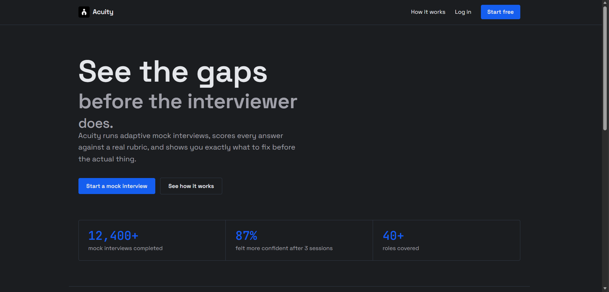
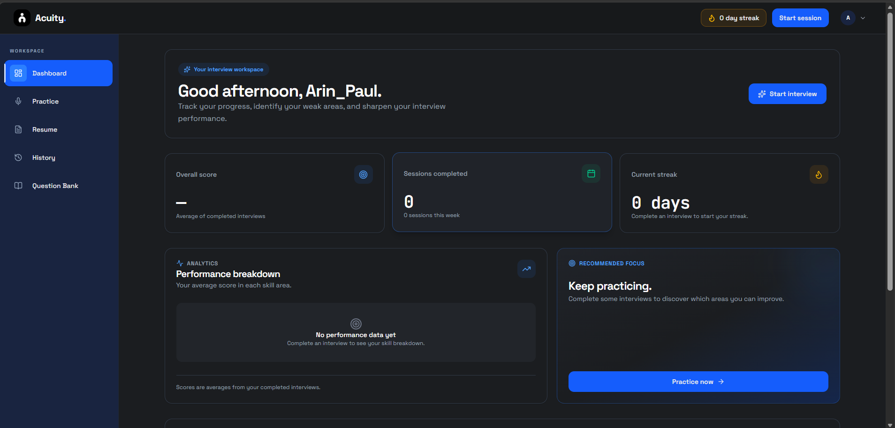
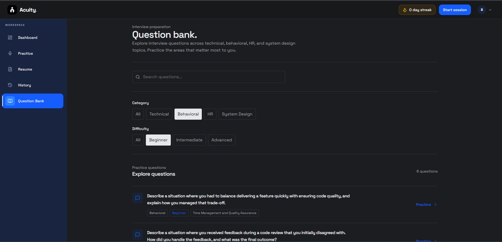
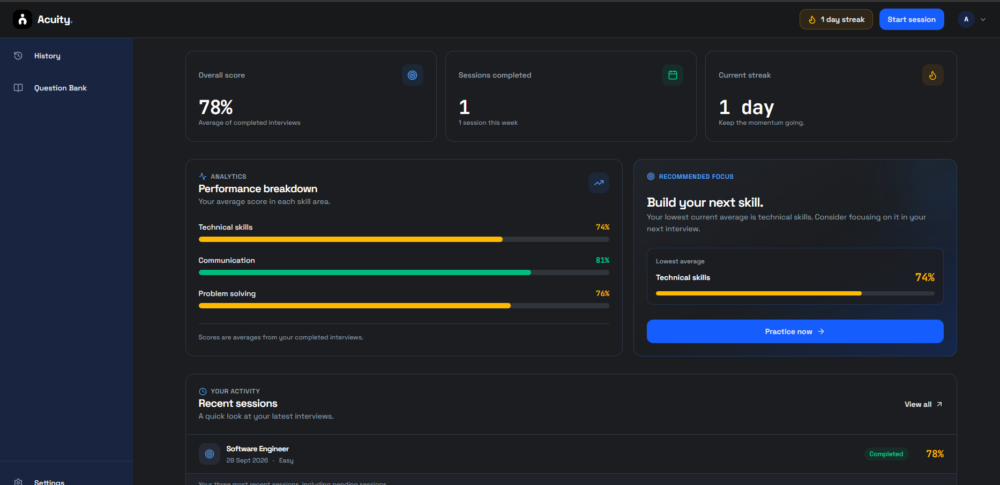

# Acuity — AI Interview Platform

Acuity is a full-stack AI-powered interview preparation platform for practicing **Technical, Behavioral, HR, and System Design** interviews.

It provides AI-generated questions, interview sessions, performance tracking, interview history, a searchable question bank, and resume management.

---

## Screenshots

| Landing Page                                  | Dashboard                                    |
| --------------------------------------------- | -------------------------------------------- |
|  |  |

| Question Bank                                        | Interview Results                                  |
| ---------------------------------------------------- | -------------------------------------------------- |
|  |  |

---

## Features

* 🔐 JWT authentication
* 🤖 AI-powered interview question generation using Groq
* 📚 Searchable and filterable Question Bank
* 🎯 Technical, Behavioral, HR & System Design interviews
* 📊 Interview performance dashboard
* 📝 Interview history and results
* 📄 Resume management
* 📱 Responsive interface
* 🔄 Paginated question browsing
* 🛡️ Duplicate and near-duplicate question detection

---

## Tech Stack

### Frontend

* React
* Vite
* Tailwind CSS
* React Router
* Axios
* TanStack React Query
* Socket.IO
* Lucide React

### Backend

* Python 3.11
* Django
* Django REST Framework
* Simple JWT
* Gunicorn
* uv

### Database & AI

* PostgreSQL
* Neon
* Groq API
* `openai/gpt-oss-20b`

### Deployment

* Render — Frontend & Backend
* Neon — PostgreSQL

---

## Architecture

```text
React + Vite
     │
     │ REST API
     ▼
Django REST Framework
     │
 ┌───┼───────────┐
 ▼   ▼           ▼
Neon Groq      JWT
 DB   API       Auth
```

---

## AI Question Generation

Questions are generated through a Django management command using Groq.

```text
Groq API
   ↓
Generate Question
   ↓
Validate Category / Difficulty / Topic
   ↓
Duplicate Detection
   ↓
PostgreSQL
   ↓
Django REST API
   ↓
React Question Bank
```

Generate questions:

```bash
uv run python manage.py generate_questions --count 10
```

---

## Project Structure

```text
Acuity/
├── backend/
│   ├── config/
│   ├── sessions/
│   │   └── management/commands/
│   │       └── generate_questions.py
│   └── manage.py
│
├── src/
│   ├── api/
│   ├── components/
│   ├── features/
│   │   ├── auth/
│   │   ├── dashboard/
│   │   ├── questions/
│   │   ├── resumes/
│   │   └── sessions/
│   └── hooks/
│
├── docs/screenshots/
├── package.json
└── README.md
```

---

## Local Setup

### Backend

```bash
cd backend
uv sync
uv run python manage.py migrate
uv run python manage.py runserver
```

### Frontend

```bash
npm install
npm run dev
```

### Environment Variables

Backend:

```env
SECRET_KEY=your_secret_key
DATABASE_URL=your_postgresql_url
GROQ_API_KEY=your_groq_api_key
```

Frontend:

```env
VITE_API_BASE_URL=http://127.0.0.1:8000
```

---

## Application Flow

```text
Login / Register
       ↓
   Dashboard
       ↓
Question Bank → Practice
       ↓
Interview Session
       ↓
    Results
       ↓
    History
```

---

## Deployment

```text
Frontend → Render
Backend  → Render
Database → Neon PostgreSQL
AI       → Groq API
```

---

## Author

**Ujjwal Kumar**
BTech CSE

GitHub: [@Ujjvl-hub](https://github.com/Ujjvl-hub)

---

## License

No license has currently been specified for this project.
