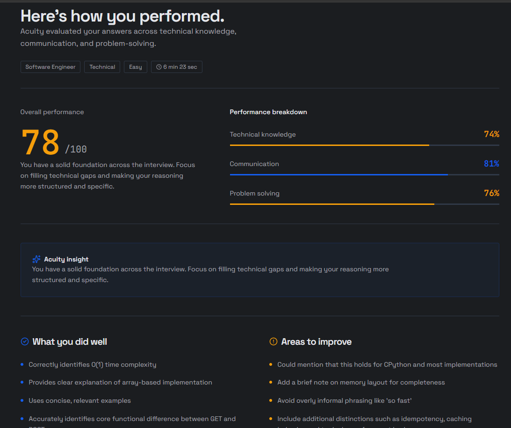

# Acuity — AI Interview Platform

Acuity is an AI-powered interview practice platform designed to help candidates prepare for technical and behavioral interviews. It provides a structured interview experience, AI-generated questions, and feedback to help users understand and improve their performance.

> **Note:** Replace the screenshot placeholders below with screenshots from your running application.

## Screenshots

Add your screenshots to `docs/screenshots/` using the filenames below, or update the paths to match your files.

| Landing Page | Dashboard |
|---|---|
|  |  |

| Interview Session | Interview Results |
|---|---|
|  |  |

## Features

- **AI-powered interviews:** Practice with questions generated for the selected role and interview settings.
- **Interview evaluation:** Receive structured feedback on technical skills, communication, and problem-solving.
- **Interview sessions:** Create and complete interview practice sessions.
- **Dashboard:** Review interview activity and performance information.
- **Interview history:** Revisit previous sessions and their results.
- **Question bank:** Access interview questions.
- **Resume section:** Manage resumes within the application.
- **Authentication:** Register and sign in to access protected features.

## Tech Stack

### Frontend
- React
- Vite
- Tailwind CSS
- React Router
- Axios
- TanStack Query
- Lucide React

### Backend
- Python
- Django
- Django REST Framework
- SQLite
- Simple JWT

### AI
- Groq API
- LangChain

## Project Structure

```text
Acuity/
├── backend/
│   ├── ai/
│   ├── config/
│   ├── sessions/
│   ├── users/
│   ├── manage.py
│   └── pyproject.toml
├── src/
│   ├── api/
│   ├── assets/
│   ├── components/
│   ├── context/
│   ├── features/
│   ├── hooks/
│   ├── providers/
│   └── routes/
├── package.json
└── README.md
```

## Getting Started

### Prerequisites

- Node.js and npm
- Python 3.11
- uv
- A Groq API key

### 1. Clone the repository

```bash
git clone https://github.com/Ujjvl-hub/Acuity.git
cd Acuity
```

### 2. Configure the backend

```bash
cd backend
uv sync
```

Create a `.env` file in the backend directory. Add the environment variables required by your Django settings and AI service. At minimum, configure your Groq API key:

```env
GROQ_API_KEY=your_groq_api_key
```

Set any other required Django settings (such as the secret key and allowed hosts) according to your local configuration. Do not commit real secrets.

Apply database migrations and start the backend:

```bash
uv run python manage.py migrate
uv run python manage.py runserver
```

The Django development server typically runs at `http://127.0.0.1:8000`.

### 3. Configure the frontend

Open a second terminal at the repository root:

```bash
npm install
npm run dev
```

Open the local URL printed by Vite in your terminal.

> Ensure the frontend API base URL in `src/api/axios.js` points to your local backend while developing locally.

## Running Tests

From the backend directory:

```bash
uv run python manage.py test
```

From the repository root, create a production frontend build:

```bash
npm run build
```

## Screenshots: adding your own

1. Run Acuity locally and open each page you want to capture.
2. Take screenshots of the landing page, dashboard, interview session, and results page.
3. Create the folder `docs/screenshots/` in the repository root.
4. Save the images as `landing.png`, `dashboard.png`, `interview.png`, and `results.png`.
5. Commit the README and screenshot files together.

## Future Enhancements

- More detailed interview analytics and progress tracking.
- Additional interview roles and question categories.
- Expanded evaluation and feedback options.
- Deployment and production-readiness improvements.

## Contributing

Contributions, suggestions, and bug reports are welcome. For significant changes, open an issue first to discuss the proposed update.

## Author

**Ujjwal Kumar**

- GitHub: [@Ujjvl-hub](https://github.com/Ujjvl-hub)

## License

No license has been specified yet. Add a `LICENSE` file if you intend to publish the project under an open-source license.
